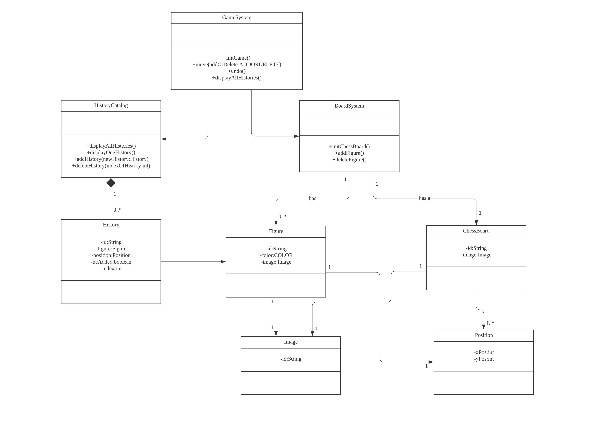
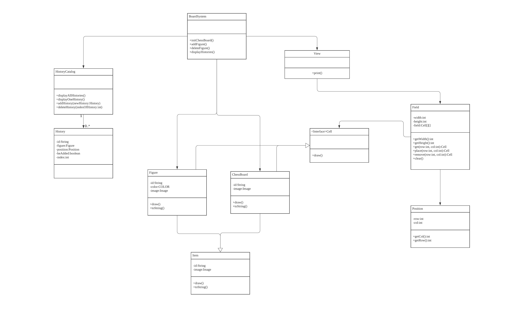
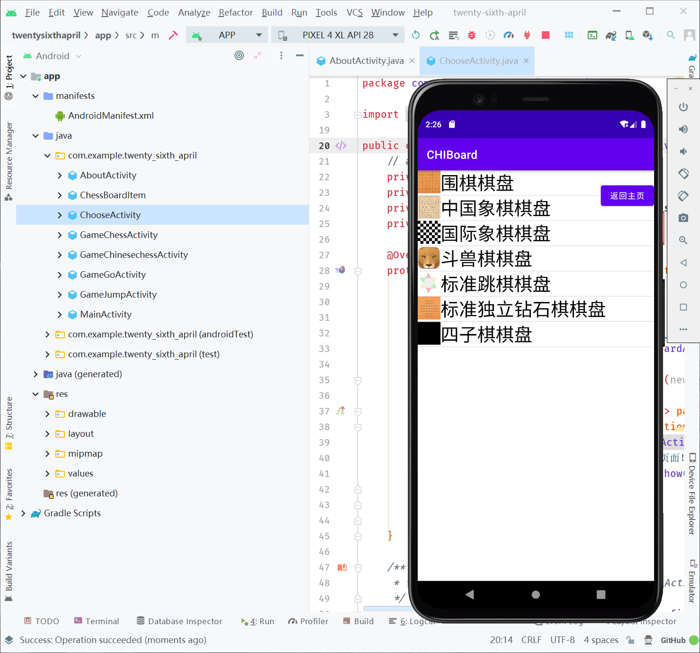
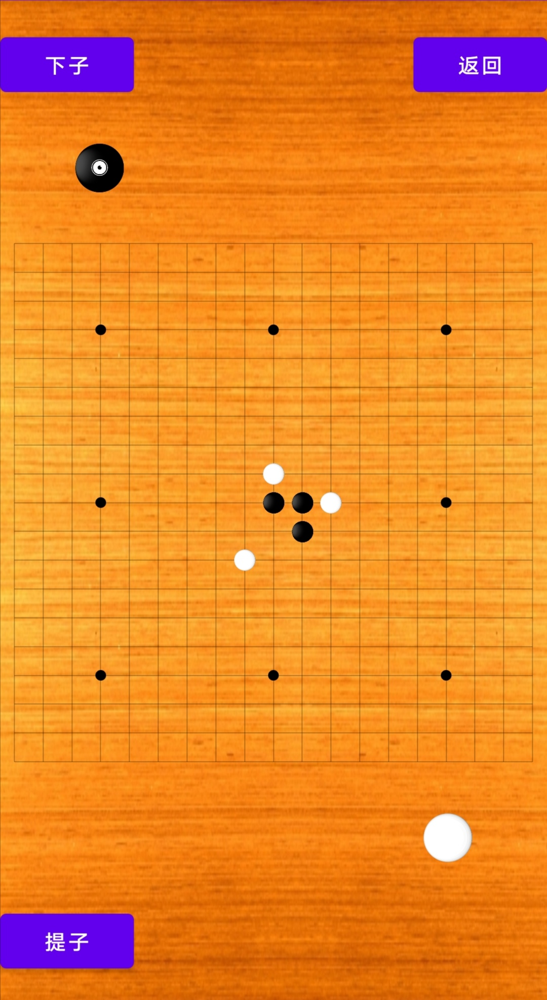

## 小组分工

陈怡君：负责app内所有与图片有关的活动，包括但不限于：制作棋子的图片、为app各个界面寻找/制作合适的背景，等等

胡未名：负责所有app功能的代码实现，包括但不限于：界面跳转、棋盘绘制、下棋操作，等等。

## 2021.3.24-3.30

本周是小组开工的第一周，大概做的工作有：
-   确定程序运作的平台
-   安装基本的开发环境
-   初步进行程序的UI设计
-   商讨程序可以实现的功能

#### 平台

在经过激烈的思想斗争后，我们认为，虽然PC应用的开发也许更适合Java初学者，但考虑到我们项目的使用方式，我们决定让其在Android平台上运行，即：先朝Android方向设计，如果实在遇到不可解决的困难，再退一步转向PC端。
Android应用开发用到谷歌出品的**Android Studio**，这是一款基于开源软件Intellij IDEA的IDE，因此在很多地方和IDEA十分相似。~~（再次体会到开源软件的好处）~~
关于UI设计，我们经过筛选挑出了两款合适的原型设计工具："墨刀"和"Mockplus"。墨刀仅支持年付费，在试用时不能很好地支持团队项目，所以我们最终选择了Mockplus来进行初步的原型设计。

#### UI
UI界面的绝大部分实操由陈怡君同学完成,~~(于此相对，胡未名同学需要在程序实现方面做出更多的贡献)~~设计则由两人共同商讨决定。
陈同学在3月29日晚完成了初稿，并与胡同学一起复查。参考应用市场已有的APP，陈为UI增加了用户ID、头像等界面，在与胡商讨之后，认为这一部分没有必要添加，因为小组的程序原本并不打算在云端存储用户数据，也不支持联机游戏，因此省去了很多传统APP存在的模块。最终这一部分被删除。

## 2021.3.31-4.6
本周的重大进展有：

-   学习利用Android Studio进行Android开发**(学习进度见思维导图)**
    -   基础知识
    -   常用控件
    -   常用布局
-   利用所学实现了在MockPlus上设计的原型~~(的第一个页面)~~
#### 布局

在学习了相对布局、表格布局、线性布局和帧布局后，考虑到界面要适配不同大小的屏幕，我们最终选择了约束布局，充分利用了其通过百分比控制控件摆放的位置，尽管还有一定缺陷，但的确很大程度上解决了其他布局在不同屏幕显示效果不一致的问题。
当然，这只是第一个页面，其他页面我们会更加灵活地运用所学。

## 2021.4.7-2021.4.13

-   学习画UML图（利用了课上所学，并借鉴了网上一些大佬的思路）
-   学习app页面之间的跳转

## 2021.4.14-2021.4.20

为了更好地完成项目，这周以学习、打基础为主。

-   抽象：语法，应用
-   接口：语法，设计原则
-   控制反转
-   MVC模式
-   异常处理

本周用MVC模式重写了项目的类图。

## 2021.4.21-2021.4.27

-   利用一种麻烦的方法，勉强解决了app不能退出的问题，但此解决方案只适用于小型app（比如我们的）
-   学习了优化手机UI的方法，并利用ListView控件实现了游戏“选择棋盘”的功能。

## 2021.4.28-2021.5.7

本周学习为主

- Fragment
- ViewPager

## 2021.5.8-2021.5.11

- 在项目中尝试应用单例模式和策略模式
- 实现围棋棋盘的绘制、下子和提子操作

## 2021.5.12-2021.5.18

- 优化了围棋棋盘中参考点的位置、形状，使棋盘更像一个围棋棋盘
- 为Licence的展示添加了Fragment，尝试其创建、入栈、出栈等操作

## 2021.5.19-2021.5.25

- 优化下棋体验，双方现在可以交替下子，也可以自行指定下棋的一方，app提供友好的提示，让用户很方便地知道下一个下棋的是哪一方

